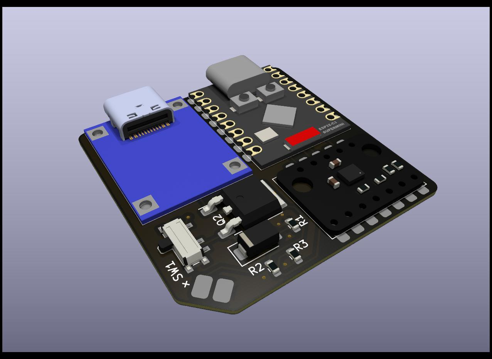
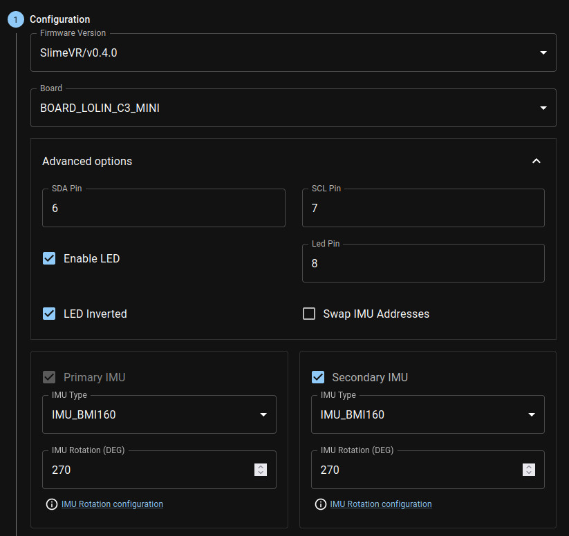
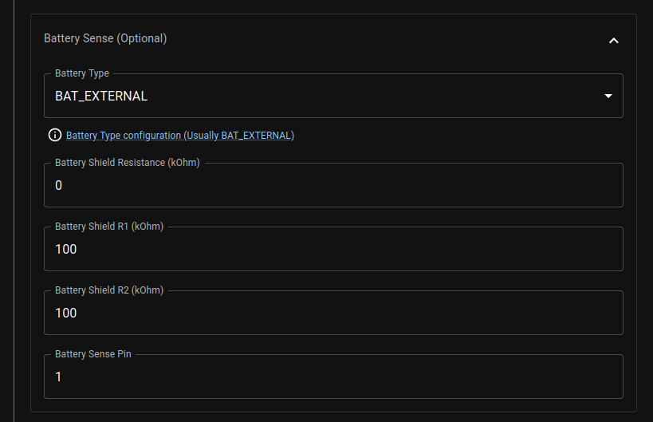

> [!WARNING]
> This project is currently experimental. While unlikely, changes in the parts, the PCB and the case could happen. Proceed with it at your own caution!

# Tiny Slime

Tiny Slime aims to make the smallest possible SlimeVR trackers out of cheap and
readily available modules while still preserving battery life.

The design uses a PCB to mount the parts to, which is placed right on top of
the battery for minimal height. The final case dimensions, without the strap
loops end up being around 43x43x15.2 mm or 43x43x12.2 mm.

## Navigation

- [Negatives](#negatives)
- [BOM](#bom)
- [PCB Ordering](#pcb-ordering)
- [Tools](#tools)
- [Soldering](#soldering)
- [Flashing](#flashing)
- [Diagnosing problems](#diagnosing-problems)
- [Case](#case)

- [Selling Guide](./SELLERS_GUIDE.md)

## Negatives

Tiny-slime does come with some caveats that make it not ideal in certain situations. I believe in being completely
transparent about things, so I'll list those out here.

#### Antenna performance

This is the main compromise of using the Supermini modules. Their antenna quality is quite bad. If you are not in the same
room as the router the trackers connect to, it quite likely won't work very well. This will hopefully be solvable
by using a dongle for them (currently in the works), but for the time being I can't recommend this if your router is
far away from your playspace.

#### Alternative hardware

The main difference that could cause issues is again, the Supermini. Since it's a different microcontroller than the one
used in either the common DIY builds or the ones used in the official trackers, there's no guarantuee, that there won't
be small issues that might take a bit of time to get solved. I'm using these myself and besides the battery readout
not working on the stable releases at the time of writing, I haven't found a single other issue with them, but YMMV.

## BOM

| Part                                  | Count | Source                                                                |
| ------------------------------------- | ----: | --------------------------------------------------------------------- |
| Tiny Slime PCB                        |     1 | JLCPCB                                                                |
| Tiny Slime Case                       |     1 | Print yourself or [order it from someone](https://discord.com/channels/817184208525983775/1176860516140978308)|
| Supermini ESP32C3                     |     1 | [AliExpress](https://www.aliexpress.com/item/1005005877531694.html)\* |
| BMI shaped IMU                        |     1 | [AliExpress](https://www.aliexpress.com/item/4000052683444.html)      |
| Unprotected USB-C TP4056 1 |     1 | [AliExpress](https://www.aliexpress.com/item/1005005468881238.html)\* |
| PCM12 compatible switch               |     1 | [AliExpress](https://www.aliexpress.com/item/4000685483225.html)      |
| SS34 diode                            |     2 | [AliExpress](https://www.aliexpress.com/item/1005002813143363.html)   |
| 1206 100k Ω resistor                  |     2 | [AliExpress](https://www.aliexpress.com/item/1005006358156511.html)\* |
| 804040 or 504040 battery 2 |     1 | [AliExpress](https://www.aliexpress.com/item/1005002559604104.html)   |

> [!TIP]
> The case is compatible with any BMI breakout shaped module. Check out [Meia's
> IMU store](https://store.kouno.xyz) for some recommended alternatives usable on
> this board!

\*: Link is multi-choice, pay careful attention to which you select

1: For size reasons, the PCB uses specifically unprotected TP4056 modules.

2: Battery choice is a trade-off. The 804040 should give you 800 mAh more
capacity at the cost of 3 extra millimeters in height.

Components, including straps cost about $11 per tracker shipped.

> [!TIP]
> These links only act as examples. They will almost certainly not be the best
> prices for you, as that depends on where you live and what options you have
> available to you. If you want to min-max the prices, do search around for
> better deals. Just make sure you are getting the right components!

> [!TIP]
> Some components are more prone to arriving dead, like BMI160. Because of this,
> and just to be safe, make sure to get a few extras from everything.

> [!TIP]
> Some of the links above sell items in packs, rather than individually. For
> example the resistors come in packs of 100. You don't need more than one of
> those in your cart.

> [!CAUTION]
> Since the TP4056 module the PCB is using is unprotected, make sure to only
> ever pair it with a battery that comes with a protection board. Usually
> protected batteries have yellow tape around their top side which houses a
> small protection PCB. Using unprotected batteries could lead to them dying
> or in extreme cases catching fire or exploding.

## PCB Ordering

The gerber zip file for the PCB can be downloaded from the "production" folder
of the repository. This needs to be ordered from a PCB manufacturer, such as
JLCPCB.

### Ordering from JLCPCB

1. Visit [JLCPCB's site](https://jlcpcb.com)
2. Hit the "Add gerber file" button and select the zip file you've downloaded
3. Select the quantity of PCBs you want
4. Set the PCB thickness to 0.8 and select a colour you like

> [!IMPORTANT]
> Some colours might incur further costs, because they are rarer. Black and
> green are almost always free to choose.

5. For the "Remove Order Number" option, choose "Specify a location"
6. Make sure PCB Assembly is ticked **off**
7. Save the order to your cart and complete the ordering process

If you've done everything correctly, 5 PCBs should cost about $5 while 10 should
cost about $7 with shipping included. You can of course choose a quicker
shipping method, but the AliExpress components take more time to arrive.

> [!TIP]
> It's recommended that you purchase more boards than you'd strictly need, since
> they are fairly cheap and mistakes can easily happen.

## Tools

There are some tools that will be necessary for putting the tracker together,
and there are some that are useful to have, even if not strictly necessary.

#### Soldering iron (required)

For a soldering iron, you want something temperature controlled. If you live in
a country with Amazon, [something like this](https://www.amazon.com/LDK-Soldering-Adjustable-Temperature-Replacement/dp/B083L8BXRC/ref=sr_1_15)
is a good start. This same iron can be found on AliExpress for about $3, if you
look for it.

#### Solder wire (required)

If you have soldering wire that came with the iron you have, it's probably not
great, but it should work in a pinch (I still recommend buying some if you can
afford it). If you need to buy it new, it's probably worth looking for something
thinner, 0.5-0.6 mm in diameter. [This is what I generally use](https://www.aliexpress.com/item/32824531083.html).
You can go with leaded or lead-free, but make sure you have decent ventillation
wherever you work.

> [!CAUTION]
> There are so-called "low temperature" solder rods. These are made for plumping
> and are not usable for soldering electronics. If they specifically call out
> that you can melt them with a lighter, those are also for that purpose, avoid!

#### Tweezers (required)

Some parts on this board are smaller than what most people are used to. To help
avoid burns and to make the process easier, you should get at least a cheap set
of tweezers. [Something like this should work](https://www.aliexpress.com/item/1005005633143159.html),
you mainly want the ones that are either straight and sharp or bent, depends on
the person, which is easier to work with.

#### Flux (recommended)

Flux is a liquidy paste that helps solder flow better. It's mainly used when you
need to rework a soldering joint after you've already created it. Theoretically
it can be substituted by just adding more solder to the joint, since most solder
wires contain flux, but that's not always a solution. Flux is most commonly
either in the form of a pen or in the form of a syringe. [This is the one I tend
to use](https://www.aliexpress.com/item/1005005420936672.html), and it worked
great for me.

> [!CAUTION]
> There are certain flux pastes that are, like the previously mentioned solder
> rods, made for plumbing. These are corrosive, to help with the oxidization
> present on pipes. You can recognize these by either reading the label, or
> often they look like grease (hence their other name, soldering grease). Avoid
> these!

#### Some kind of soldering sponge (recommended)

When soldering, often there will be a build up of molten solder on your
soldering iron. To get it off, you can use a damp soldering sponge, or a brass
sponge. The former is quite a bit cheaper, you can get [5 or 10 for less than a
dollar](https://www.aliexpress.com/item/1005005601077918.html), though it will
theoretically damage your soldering tip a tiny bit more than the other option.
[Brass sponges](https://www.aliexpress.com/item/1005005256184789.html) are more
expensive, but avoids this slight damage a bit better and are generally a bit
quicker to use.

#### Desoldering wick (recommended)

In a perfect world, we don't make mistakes, but we aren't in that perfect world.
When you need to desolder something, or potentially clean a pad from solder that
got on it, the simplest option you have is a desoldering wick, or desoldering
braid. You want something fairly thin, since that would be easier to heat up.
[You can start with something like this](https://www.aliexpress.com/item/1005004960109258.html).

#### Desoldering pump (recommended)

Although a desoldering wick is generally enough, another tool you might want to
have for the job is a desoldering pump. These work by quickly sucking away
molten solder. It's not as necessary for these sort of components, but it's
useful in some cases. [Something akin to this](https://www.aliexpress.com/item/1005005623725652.html)
is what I'd go for.

#### Flush cutters (recommended)

Some flush cutters are needed for some \*modifications\* that I recommend you
make for an easier soldering process. [Something like this](https://www.aliexpress.com/item/1005005415704038.html).
They are fairly easy to blunt out, so you might want to buy a couple.

#### Multimeter (recommended)

Multimeters can be used to check for connections, so you don't need to guess
what the actual issue is. They are fairly useful even in one's day-to-day life
(checking disposable batteries, checking wires in the wall, etc. etc.), so I
recommend picking one up. If you do, make sure it has at the very least a
continuity mode (usually denoted with a dot with waves coming out of it). This
is the most necessary for checking if you have a bad connection. [Something like
this](https://www.aliexpress.com/item/1005006195161900.html) will certainly
work, but they are also fairly cheap to buy in your local hardware store.

#### PCB cleaning fluid (optional)

After working on a PCB, there might be some gunk on it left over from the
soldering process. If you care for how the PCB looks, or you want to make sure
you see the joints better, you might want to invest into some PCB cleaning
fluid. [I use this](https://www.aliexpress.com/item/1005004419000732.html). These
are almost always nasty fluids, so make sure you don't breathe them in too much.

## Soldering

> [!NOTE]
> This part of the guide is incomplete. I'll update it with photos and videos of
> the process once I make them.

Soldering the board is a fairly simple and straightforward process, however
there can be a few pitfalls that are easy to fall into if you've never done
anything like this before.

The general rule of thumb is that you want to start with smaller components and
slowly make your way towards the bigger components, but placement can also play
a role in this.

I'll be detailing each step and in the order I recommend you do them in. If you
feel like a particular component is giving you trouble, try soldering it on
earlier, that way you have more space to do the operation in.

#### Switch

The switch is sadly the only component on the PCB I couldn't supersize. As a
result, it's probably the one that requires the most accuracy.

Start by putting a tiny blob of solder on one of the side mounting pads, and
then, while remelting the blob, put the component in place. This should secure
it enough that you shouldn't need to worry about the switch moving while you
work on the rest.

Afterwards you should continue on the other side of the switch, soldering in the
other mounting pins there, before moving back onto the one you've started on and
finishing the job.

Finally, solder in the three electrical pins.

To-Do: Video about soldering the switch

#### Resistors

The resistors are so-called 1206 resistors. This means They are about
0.12x0.06 inches, or 32x16 mm in size. This is considered fairly big in terms
of electronics, and it's quite simple to solder them in.

First, put a solder blob onto one pad of the resistor, then, while remelting it,
gently place the resistor between the two pads. Once that's done, just solder in
the other pad, and you should be done.

To-Do: Include video of soldering the resistors

#### Diodes

Now onto the last "small" component. The diodes have one of the larger form
factors available for surface mount soldering. They are very similar in
technique to the resistors.

Firstly, orientation is important. Notice, how the diodes' pads have an
incomplete rectangle around them. If you look carefully on the diode itself, it
should have a few lines on one side. Make sure these lines are on the same side
as the complete side of the rectangle.

First put solder on one pad, then while remelting it, place the diode in between
the two pads, then solder in the other pad.

To-Do: Include video of soldering the diodes

#### TP4056

This is where the fun part begins. To keep the end result as thin as possible, I
opted to not use through holes when mounting the large modules in place. This
makes it more of a challenge to solder them in place.

One technique that works well, even if it's a bit unorthodox is cutting off the
corners of the charging module with flush cutters, giving you DIY castellations
(half circle pads that are made for soldering flush). Afterwards, you can just
heat the center of the pad while feeding it with solder wire, and eventually it
should spread towards the TP4056's pads, connecting it to the PCB.

If you don't want to, or can't cut the corners off, you can still solder the
module in place by just putting a lot of solder into the hole, but I recommend
checking the end result with a multimeter, if you do so.

For the best result, make sure you align the edge of the charging module with
the edge of the PCB, so the charging cable can make a good connection to it.

To-Do: Include video of soldering the TP4056

#### Supermini ESP32C3

The brain of the entire tracker is fairly simple to solder, since it was made to
be mounted on PCBs like this, hence the castellations on the side.

First, put a blob of solder on one of the pads, and place the module into its
rectangle while remelting the joint. This probably won't result in a very strong
connection, but it will be enough to not have to worry about it while you do the
rest. Ideally you should then solder a pin that's further away from the one
you've just soldered to give it more stability. Then go through one by one,
soldering in all the joints. A good connection should make a small bridge
from the PCB's pad onto the side of the Supermini. I recommend going over the
original joint you've made also, just so it's secure enough.

To-Do: Include video of soldering the Supermini

### Soldering the IMU

The IMU is a special challenge on this board. I tried to make sure that it's as
easy as possible to get it mounted on the PCB, but it's still not simple. There
are several methods to go about it, which will depend on what IMU you have and
what you are willing to do with it. I'll try to list them in the order of simple
to difficult.

To-Do: Include videos of all three methods

#### Getting IMUs with castellations

[Meia's store](https://store.kouno.xyz/) sells BMI270 modules that are made with
castellations on them. These are ideal for this PCB, since those are
specifically designed for this purpose.

#### Making DIY castellations

This is the same idea as with the TP4056 module. Just go through the side with
the 7 pins, and cut them in half one by one. I recommend first making a cut from
the side of the hole towards the center on the longer side, and then cutting it
off from the side. This way you have enough space to make the rest of the cuts
also.

Afterwards it's the exact same method as for the Supermini, just go through each
pin and put on enough solder until a small bridge forms from the PCB to the IMU.

#### Filling the holes with solder

This strategy I can't recommend, because it's very hit or miss. But, if you put
enough solder into each hole, theoretically it should result in a solid
connection eventually. The problem with this method is that you can't really see
the joint, so you don't know if it's even there or not.

First start by putting a blob of solder onto one pad and placing the IMU into
the rectangle while remelting it. This should keep it in place while you work on
the rest.

For the remaining pins, heat the ring around the pad and just push in the solder
wire, until a visible blob forms at the top. To make it more likely that a joint
is formed, you can put solder on the side of the pad that comes out from under
the IMU, and then quickly move between the blob at the top and the solder on the
side. This gives it a better chance at connecting the two.

If you have a multimeter, it's recommended that you check the connections, once
you are done, so you know if they are well-made or not.

### Soldering with a hotplate

The easiest and quickest way to solder the PCB is using solder paste and a
hotplate. Although they are not expensive, these are generally unnecessary
expenses on top of the other tools you already have, but if you need to solder a
lot of these together, it might just be worth it.

If you are looking for an inexpensive hotplate, I can recommend [this one](https://www.aliexpress.com/item/1005005549693756.html)
(select the one labeled "Type1"). It's relatively small, only enough to solder
one of these at a time, but for $20, it does its job well. You will need a
USB-C charger for it that can deliver 65W (most modern laptop chargers can
achieve this).

As for paste, almost any will do, though my recommendation is [this 138C
paste](https://www.aliexpress.com/item/1005004333086374.html) containing bismuth,
since at those temperatures, it's unlikely that the modules on the PCB will be
affected.

The method is as simple as putting small blobs of solder paste onto the pads,
and then heating the hotplate 10-15 C above the melting temperature of the paste
while the board is on top of it. For the modules with rows of pins on the sides,
you can just draw a line across them.

This gives probably the cleanest results out of the bunch, and it works without
having to first mutilate the modules by cutting pieces off of them.

## Flashing

For flashing use [the online firmware flasher tool made by Butterscotch](https://slimevr-firmware.bscotch.ca/). There
will be a few changes you need to make to the defaults for it to work properly.

> [!TIP]
> Don't want to go through the hassle? [Here's a link](https://slimevr-firmware.bscotch.ca/?config=eyJib2FyZCI6eyJ0eXBlIjoiQk9BUkRfTE9MSU5fQzNfTUlOSSIsInBpbnMiOnsiaW11U0RBIjoiNiIsImltdVNDTCI6IjciLCJsZWQiOiI4In0sImxlZEludmVydGVkIjp0cnVlLCJlbmFibGVMZWQiOnRydWV9LCJpbXVzIjpbeyJ0eXBlIjoiSU1VX0JNSTE2MCIsInJvdGF0aW9uIjoyNzAsImltdUlOVCI6IjYiLCJlbmFibGVkIjp0cnVlfSx7InR5cGUiOiJJTVVfQk1JMTYwIiwicm90YXRpb24iOjI3MCwiaW11SU5UIjoiOCIsImVuYWJsZWQiOnRydWV9XSwiYmF0dGVyeSI6eyJ0eXBlIjoiQkFUX0VYVEVSTkFMIiwicmVzaXN0YW5jZSI6IjAiLCJyMSI6MTAwLCJyMiI6IjEwMCIsInBpbiI6IjEifSwic3dhcEFkZHJlc3NlcyI6ZmFsc2UsInZlcnNpb24iOiJTbGltZVZSL3YwLjQuMCJ9)
> with most of the necessary changes already done, just change the firmware
> version, IMU (if using anything other than a BMI160) and input your Wi-Fi
> credentials.

For firmware version, when running with BMI160, choose the latest stable
release. This will likely be the topmost one. At the time of writing, this is
0.4.0. If you are using BMI270, you want to select the `l0ud/main` option, as
this is the one that contains the necessary changes for the IMU to work.
Similarly, for LSM6DSV, you want the `wigwagwent/lsm6dsv-with-bug-fix` option.

For the board, you want to choose `BOARD_LOLIN_C3_MINI`.

Open Advanced options, change SDA Pin to "6", SCL Pin to "7", and Led Pin to
"8". The rest of the options should stay default.

For primary and secondary IMU, select the one you have. The rotation value
shouldn't matter if you use Automatic Mounting Calibration in the server.

Now open up the Battery Sense section, select battery type as `BAT_EXTERNAL`,
put "0" as the battery shield resistance, and 100 for both battery shield R1 and
R2. Also change the battery sense pin to "1".

> [!NOTE]
> At this time the battery sense won't work quite correctly for this board
> because of a bug. A fix for this issue is already in the works waiting to get
> accepted.

Now open up the Wi-Fi settings section and input your **2.4GHz** Wi-Fi's
credentials.

After you've done this, it's time to plug in the Supermini. To make sure it's flashable,
first double check that it's turned off, then hold down the left button on it labeled
"BOOT", and while holding it down, plug it into your PC. Some units have some preflashed
software on them, for example it might blink the LED on-board. If it starts doing that,
that means you didn't do the previous step properly, try again.

After flashing you need to manually reset the Supermini. This can be done by either hitting
the reset button (the one on the right labeled "RST") or by just unplugging it and powering
it on. If everything went well and your SlimeVR server is turned on, it should be able to
connect and appear in there.

## Diagnosing problems

To-Do

## Case

The case is made up of 3 parts, a bottom, a top and a switch extender. These
were designed to not require any support, or brim when printing them, though
some mouse ears can help, if you experience warping around the strap loops.

#### Printing

The ideal orientation of the parts is the following:

I recommend printing the switch at the very least separately, since it's quite
small, so slowing down the printing might help you get a more accurate print.

The following print settings worked well for me, but feel free to experiment
with them:

- Layer height: 0.2 mm
- Line width: 0.4 mm
- Wall line count: 4
- Infill pattern: Cubic\*
- Infill density: 10%\*
- Supports: off
- Build plate adhesion: none

\*: There's barely any parts of the case that are thick enough to require
infill, so don't stress about this much.

#### Assembly

To-Do: include a video of the assembly process

After printing, first slide the USB-C ports into the corresponding holes at an
angle and then push the other end of the battery and PCB into the case.
Afterwards take the printed switch extender and slide it onto the switch on the
PCB. Finally, snap the lid on. If you can't easily to this last step, try first
aligning one side of the lid into the corresponding holes and then rotate it
into place, snapping the holders in as they meet the edge.
